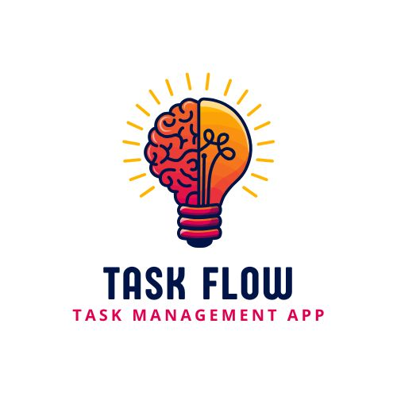
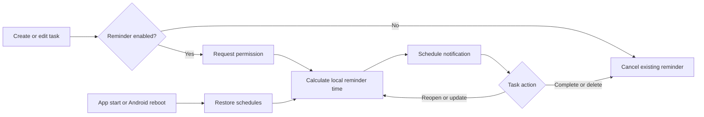

<div align="center">
  

  <h1>TaskFlow</h1>

  <p><strong>A focused, offline-first task manager built with Flutter.</strong></p>

  <p>
    Plan your day, organize priorities, create recurring tasks, and receive<br />
    timezone-aware local reminders without sending personal task data to a server.
  </p>

  <p>
    <a href="https://flutter.dev"></a>
    <a href="https://dart.dev"></a>
    <a href="https://developer.android.com"></a>
    <a href="pubspec.yaml"></a>
    <a href="test/widget_test.dart"></a>
  </p>
</div>

---

## ✨ Overview

TaskFlow is a local task-planning application designed for quick daily use.
Tasks are stored in SQLite on the device and can include notes, schedules,
priorities, reminder preferences, colors, and recurrence rules.

The app provides a daily progress view, calendar navigation, search and status
filters, swipe actions, dark mode, and a complete local-notification lifecycle.

### Why TaskFlow?

- 🔒 **Private by default** — task data stays in the local SQLite database.
- 🔔 **Useful reminders** — notifications follow task creation, editing,
  completion, reopening, duplication, and deletion.
- 🔁 **Recurring planning** — supports daily, weekly, and monthly tasks.
- 🎯 **Clear priorities** — label work as Low, Medium, or High priority.
- 🌗 **Comfortable viewing** — includes polished light and dark themes.
- 📱 **Responsive interface** — works across phone and tablet layouts.

---

## 🚀 Features

### Task management

- Create, edit, duplicate, move, complete, reopen, and delete tasks.
- Add an optional note to each task.
- Set start and end times.
- Assign one of three accent colors.
- Set Low, Medium, or High priority.
- Repeat tasks daily, weekly, monthly, or not at all.
- Move an existing task to tomorrow from the task action sheet.

### Daily planning

- Navigate dates using the horizontal calendar.
- View open, completed, and total task progress.
- See the next pending task for the selected day.
- Search task titles and notes.
- Filter the list by All, Open, or Done.
- Sort visible tasks by their scheduled start time.
- Use swipe gestures to delete or complete/reopen tasks.

### Local notifications

- Enable or disable reminders per task.
- Choose a reminder lead time of 5, 10, 15, 20, 30, or 60 minutes.
- Schedule one-time, daily, weekly, and monthly reminders.
- Calculate notification times using the device's local timezone.
- Request notification permission when a reminder is first needed.
- Cancel reminders when a task is completed or deleted.
- Restore reminders when a task is reopened.
- Reschedule reminders after task edits.
- Restore all pending task reminders when the app starts.
- Restore Android schedules after reboot or app replacement.
- Open the related task actions when a notification is tapped.
- View permission state and pending reminder count in the notification center.
- Send a test notification from the notification center.

> [!NOTE]
> Android reminders use an idle-friendly inexact schedule mode. The operating
> system may deliver a reminder slightly later while applying battery
> optimizations.

---

## 🧭 Notification Lifecycle



The reminder time is calculated as:

```text
task start time - selected reminder minutes
```

For example, a task starting at **9:00 AM** with a **15-minute** reminder
produces a notification around **8:45 AM** in the device's current timezone.

---

## 🛠️ Technology Stack

| Area | Technology | Purpose |
|---|---|---|
| UI | Flutter + Material | Cross-platform interface |
| Language | Dart | Application logic |
| State/navigation | GetX | Reactive task state and navigation |
| Storage | SQLite / sqflite | Offline task persistence |
| Settings | GetStorage | Theme preference storage |
| Notifications | flutter_local_notifications | Local notification delivery |
| Timezones | timezone + flutter_timezone | Timezone-aware scheduling |
| Calendar | date_picker_timeline | Horizontal date navigation |
| Animation | flutter_staggered_animations | Task-list transitions |
| Typography | Google Fonts | Lato-based text styling |
| Graphics | flutter_svg | SVG empty-state artwork |

---

## 🗂️ Project Structure

```text
task_manager_app/
├── android/                         # Android app, manifest, and signing config
├── ios/                             # iOS runner and notification delegate
├── images/                          # App logo and visual assets
├── lib/
│   ├── controllers/
│   │   └── task_controller.dart     # Task operations and reminder lifecycle
│   ├── db/
│   │   └── db_helper.dart           # SQLite initialization and migrations
│   ├── models/
│   │   └── task_model.dart          # Task data model and serialization
│   ├── screens/
│   │   ├── pages/
│   │   │   ├── add_task_page.dart  # Create/edit task form
│   │   │   └── home_page.dart      # Dashboard, filters, and task actions
│   │   ├── widgets/                 # Shared fields, buttons, and task tiles
│   │   └── theme.dart               # Light/dark themes and design tokens
│   ├── services/
│   │   ├── notification_services.dart
│   │   └── theme_services.dart
│   └── main.dart                    # App initialization
├── test/
│   └── widget_test.dart             # Model and migration-default tests
├── pubspec.yaml                     # Dependencies, version, and assets
└── README.md
```

---

## 💾 Task Data Model

TaskFlow currently stores the following fields:

| Field | Type | Description |
|---|---|---|
| `id` | Integer | Local auto-incrementing identifier |
| `title` | String | Required task title |
| `note` | Text | Optional details |
| `date` | String | Scheduled calendar date |
| `startTime` | String | Task start time |
| `endTime` | String | Task end time |
| `remind` | Integer | Minutes before the task |
| `reminderEnabled` | Boolean/Integer | Whether a reminder is scheduled |
| `repeat` | String | None, Daily, Weekly, or Monthly |
| `priority` | String | Low, Medium, or High |
| `color` | Integer | Selected accent-color index |
| `isCompleted` | Integer | Open or completed state |

The database is currently at **schema version 2**. Existing version 1 databases
are migrated in place with:

- `priority = Medium`
- `reminderEnabled = true`

---

## ✅ Requirements

Before running the project, install:

- [Flutter SDK](https://docs.flutter.dev/get-started/install) with Dart 3.2.3 or newer
- Android Studio and an Android SDK for Android development
- Xcode and CocoaPods for iOS development on macOS
- Git

Confirm the environment:

```bash
flutter doctor -v
```

---

## 📦 Installation

1. Clone the repository:

   ```bash
   git clone https://github.com/RensithUdara/task_manager_app.git
   cd task_manager_app
   ```

2. Install dependencies:

   ```bash
   flutter pub get
   ```

3. Check available devices:

   ```bash
   flutter devices
   ```

4. Run the application:

   ```bash
   flutter run
   ```

To target a specific device:

```bash
flutter run -d <device-id>
```

---

## 🔔 Notification Setup

Notification initialization happens before the Flutter UI starts. No cloud
service, Firebase project, or API key is required.

### Android

The application manifest already includes:

- `POST_NOTIFICATIONS`
- `RECEIVE_BOOT_COMPLETED`
- `VIBRATE`
- Scheduled notification receiver
- Boot and app-replacement receiver

On Android 13 and newer, the app asks the user for notification permission when
a task requiring a reminder is saved. Permission can also be managed from the
bell icon in the TaskFlow app bar.

### iOS

The iOS app delegate assigns `UNUserNotificationCenter` to the Flutter app
delegate, allowing foreground notification presentation and response handling.
The user still controls alert, badge, and sound permissions through iOS.

### Reminder behavior

- Completing a task cancels its reminder.
- Reopening a task schedules its reminder again when the reminder is still
  relevant.
- Editing a task replaces the old reminder.
- Deleting a task removes the reminder.
- Disabling the task reminder removes any existing schedule.
- Tapping a task notification opens that task's action sheet.

---

## 🧪 Quality Checks

Run static analysis:

```bash
flutter analyze
```

Run automated tests:

```bash
flutter test
```

Format the Dart source:

```bash
dart format lib test
```

The current tests cover:

- Backward-compatible defaults for older database rows
- Priority and reminder-preference serialization
- Clearing task IDs when duplicating tasks

---

## 🏗️ Building

### Android debug APK

```bash
flutter build apk --debug
```

Output:

```text
build/app/outputs/flutter-apk/app-debug.apk
```

### Android release bundle

Configure signing first, then run:

```bash
flutter build appbundle --release
```

Output:

```text
build/app/outputs/bundle/release/app-release.aab
```

### iOS

```bash
flutter build ios --release
```

An Apple Developer account and valid Xcode signing configuration are required
for device distribution.

---

## 🔐 Android Release Signing

TaskFlow intentionally fails release builds when signing credentials are
missing. Debug builds do not require release credentials.

1. Create an upload keystore:

   ```bash
   keytool -genkeypair -v -keystore android/upload-keystore.jks -keyalg RSA -keysize 2048 -validity 10000 -alias upload
   ```

2. Copy the example configuration.

   PowerShell:

   ```powershell
   Copy-Item android/key.properties.example android/key.properties
   ```

   macOS/Linux:

   ```bash
   cp android/key.properties.example android/key.properties
   ```

3. Replace the placeholder values in `android/key.properties`:

   ```properties
   storePassword=your-keystore-password
   keyPassword=your-key-password
   keyAlias=upload
   storeFile=../upload-keystore.jks
   ```

Alternatively, provide these environment variables:

- `ANDROID_KEYSTORE_PATH`
- `ANDROID_KEYSTORE_PASSWORD`
- `ANDROID_KEY_ALIAS`
- `ANDROID_KEY_PASSWORD`

> [!IMPORTANT]
> Never commit `key.properties`, a `.jks`/`.keystore` file, passwords, or
> private keys. The upload certificate (`.pem`) contains the public
> certificate and is not a replacement for the private upload keystore.

---

## 🧰 Troubleshooting

### Android installation reports insufficient storage

Check emulator/device storage:

```bash
adb shell df -h /data
```

Remove unused emulator apps or create an emulator with more internal storage.
Avoid uninstalling TaskFlow when local task data must be preserved.

### Notifications do not appear

1. Open TaskFlow's bell icon.
2. Confirm that reminders are enabled.
3. Tap **Enable reminders** or **Reschedule reminders**.
4. Send a test notification.
5. Check the operating system's notification and battery settings.
6. Confirm that the task reminder time is still in the future.

### Generated files or dependencies are stale

```bash
flutter clean
flutter pub get
flutter run
```

### Database changes are not visible

The schema migration runs when the database is opened. Fully restart the
application after changing database code; hot reload does not restart database
initialization.

---

## 🔒 Privacy

- Tasks and preferences are stored locally on the device.
- TaskFlow does not require an account.
- TaskFlow does not upload task content to a remote API.
- Local notifications are scheduled by the operating system.
- Removing the app may remove its local SQLite database and all saved tasks.

Back up important information before clearing app data or uninstalling.

---

## 🗺️ Roadmap

Potential future improvements:

- Categories, tags, and custom lists
- Task subtasks and checklists
- Calendar export and import
- Local backup and restore
- Home-screen widgets
- Accessibility and localization expansion
- Additional notification actions such as Complete and Snooze

---

## 🤝 Contributing

Contributions and thoughtful improvements are welcome.

1. Fork the repository.
2. Create a feature branch:

   ```bash
   git switch -c feature/your-feature
   ```

3. Make focused changes and add tests where appropriate.
4. Run `flutter analyze` and `flutter test`.
5. Open a pull request describing the behavior and verification performed.

---

## 📄 License

No open-source license is currently included in this repository. Unless a
license is added, the source remains under the copyright holder's default
rights.

---

<div align="center">
  

  <p><strong>Plan clearly. Focus intentionally. Finish confidently.</strong> ✨</p>
</div>
